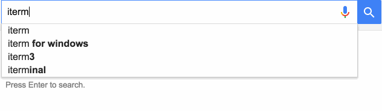

Curating a list of development resources
========================================

This is a growing list of development resources. From tools, to learning sites to tips and tricks for developers. This is an experiment. The knowledge gained from this repository will lead to something amazing.

How do you curate and share bookmarks and knowledge between all open source developers?

How do you find out what are the hottest tools for devlopment?

Imagine a list of development resources curated by developers

**Please help curate this this by forking this repo and submitting pull requests**

Popular way to find alternatives to things

An example Google search

Terminal (Mac)
------------------------

Command Prompt (Windows)
------------------------

* [Cygwin](http://cygwin.com/install.html)
* [ConEmu](https://sourceforge.net/projects/conemu/)

Continous Integration
----------------------

